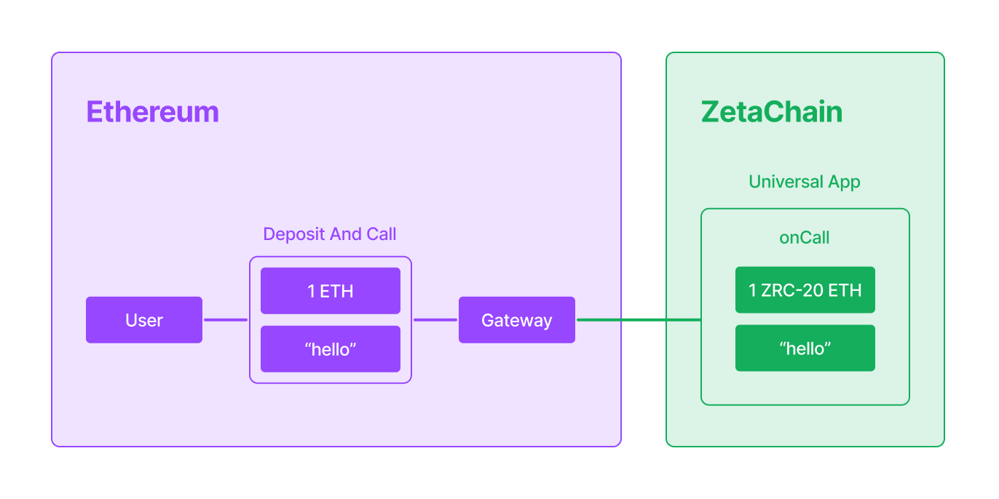

|标题|描述|
|:-|:-|
|通用 Apps|一类能够在 Ethereum、Bitcoin、Solana 等多条链之间自由沟通与协同执行的通用应用|

## 概述

通用应用是部署在 ZetaChain 上的智能合约，它原生连接着其他区块链，例如 Ethereum、BNB 和 Bitcoin 等 Layer1 。

与普通智能合约不同，通用应用不仅能接收来自任何连接链的合约调用、消息与代币转移，还可以向这些链发起合约调用与代币转移。这种双向可编排能力，使通用应用能够完成跨越多条链的复杂多步交易。

举例来说，一位 Bitcoin 用户可以通过通用应用，将 USDC 发送给 Ethereum 上的收款方。抑或是一位 Ethereum 用户可以在 ZetaChain 上购买 NFT，并将其转移至 BNB 链账户。

通用应用部署于 ZetaChain 的通用 EVM 上。该环境在传统 EVM 基础上扩展了**全链互操作**能力。这意味着你现有的智能合约无需重写即可直接运行在 ZetaChain 上，并且只需进行少量的修改，就可以获得强大的全链功能。

以下是一个通用应用的例子：

```solidity
pragma solidity 0.8.26;
 
import "@zetachain/protocol-contracts/contracts/zevm/interfaces/UniversalContract.sol";
 
contract UniversalApp is UniversalContract {
    function onCall(
        MessageContext calldata context,
        address zrc20,
        uint256 amount,
        bytes calldata message
    ) external virtual override {
        // ...
    }
}
```

## 调用通用应用

用户可通过连接链上的 **Gateway 合约**与通用应用交互。每条连接链都拥有一个唯一的 Gateway，负责接收用户的代币存入与调用请求。在调用通用应用时，用户可同时传递数据与代币。

举个例子，一位 Ethereum 用户向通用应用发送 1 ETH 与消息 "hello"。



此操作将触发通用应用的 `onCall()` 方法。

在通用应用一侧所接收的内容就包括：

- 一条消息（例如 "hello"），其中可包含任意数据，比如说收款地址、代币地址、NFT 铸造属性等。

- 以 ZRC-20 形式表示的代币（在上图示例中为 1 ZRC-20 ETH）。