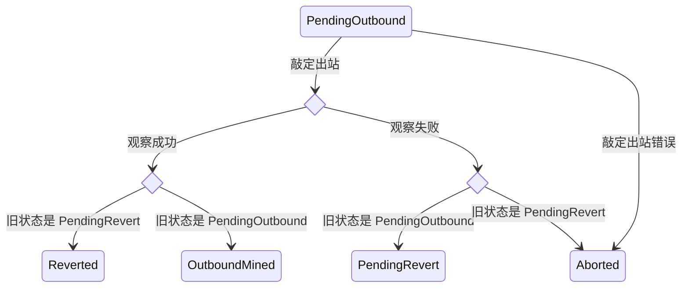
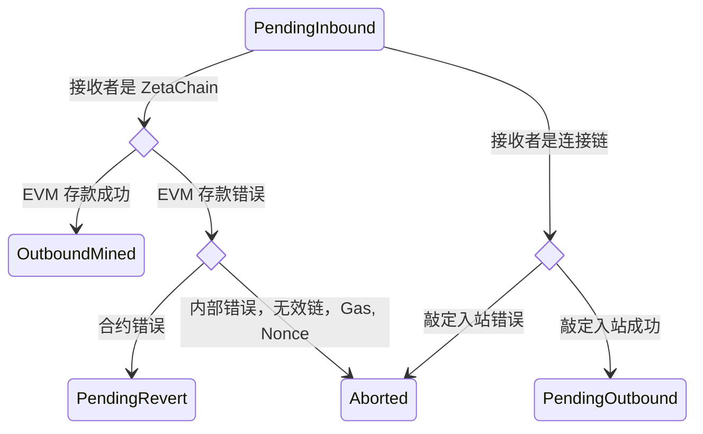

# 节点模块规范

| 标题 | 描述 |
| :- | :- |
| 节点模块规范 |  ZetaChain 的 Cosmos SDK 模块 |

## authority

### 消息

#### MsgUpdatePolicies

UpdatePolicies 更新策略

```proto
message MsgUpdatePolicies {
	string creator = 1;
	Policies policies = 2;
}
```

#### MsgUpdateChainInfo

UpdateChainInfo 更新链信息对象
如果提供的链在链信息对象中不存在，则会添加它
如果链已经存在于链信息对象中，则会更新它

```proto
message MsgUpdateChainInfo {
	string creator = 1;
	pkg.chains.Chain chain = 3;
}
```

#### MsgRemoveChainInfo

RemoveChainInfo 移除指定链 ID 的链信息

```proto
message MsgRemoveChainInfo {
	string creator = 1;
	int64 chain_id = 2;
}
```

#### MsgAddAuthorization

AddAuthorization 定义了添加授权的方法。如果授权已存在，它将被提供的策略覆盖。
这应该由管理员策略帐户调用。

```proto
message MsgAddAuthorization {
	string creator = 1;
	string msg_url = 2;
	PolicyType authorized_policy = 3;
}
```

#### MsgRemoveAuthorization

RemoveAuthorization 从列表中移除授权。它应该由管理员策略帐户调用。

```proto
message MsgRemoveAuthorization {
	string creator = 1;
	string msg_url = 2;
}
```

## crosschain

### 概述

`crosschain` 模块跟踪入站和出站跨链交易
(CCTX)。

与 Crosschain 模块交互的主要参与者是观察者验证节点
（或“观察者”）。观察者运行一个链下程序（称为
`zetaclient`），该程序监视连接的区块链以获取入站交易，
监视 ZetaChain 以获取待处理的出站交易，并监视连接的链
以获取出站交易。

在观察到入站或出站交易后，观察者会参与一个投票过程。

#### 投票

当观察者提交对交易的投票时，会创建一个 `ballot`（投票单）（如果之前未创建）。
观察者被允许投出将与此投票单关联的选票。基于 `BallotThreshold`（投票阈值），
当投出足够多的选票时，投票单被视为“已敲定”。

使投票单进入“已敲定”状态的最后一票将触发执行
并支付跨链交易的 Gas 费用。

在投票单被敲定后投出的任何选票都将被丢弃。

#### 入站交易

入站交易是在连接的链上观察到的跨链交易。
要对入站交易进行投票，观察者广播 `MsgVoteInbound`。

使投票单进入“已敲定”状态的最后一票将触发
跨链交易的执行。

如果目标链是 ZetaChain 且 CCTX 不包含消息，
ZRC20 代币将被存入 ZetaChain 上的一个帐户。

如果目标链是 ZetaChain 且 CCTX 包含消息，
ZRC20 代币将被存入，并且 ZetaChain 上的一个合约将被调用。合约地址和
合约调用的参数包含在消息中。

如果目标链不是 ZetaChain，交易的状态将
更改为“待处理出站”，并且该 CCTX 将作为出站
交易处理。

#### 出站交易

###### 待处理出站

观察者监视 ZetaChain 上的待处理出站交易。要处理
待处理的出站交易，观察者进入 TSS 密钥签名仪式以
签署交易，然后将已签署的交易广播到连接的
区块链。

###### 已观察到的出站

观察者监视连接的区块链以获取已广播的出站交易。
一旦交易在连接的区块链上“确认”（或“挖出”），
观察者通过发送 `VoteOutbound` 消息在 ZetaChain 上投票。

投票通过阈值后，投票被敲定，交易的
状态更改为最终状态。

#### 权限

| 消息 | 管理员策略帐户 | 观察者验证节点 |
| --- | --- | --- |
| MsgVoteTSS | | ✅ |
| MsgGasPriceVoter | | ✅ |
| MsgVoteOutbound | | ✅ |
| MsgVoteInbound | | ✅ |
| MsgAddOutboundTracker | ✅ | ✅ |
| MsgRemoveOutboundTracker | ✅ | |

#### 状态

该模块在状态中存储以下信息：

  - 出站交易列表
  - 链 Nonce 列表
  - 最后链高度列表
  - 跨链交易列表
  - 入站交易和跨链交易之间的映射
  - TSS 密钥
  - 观察者提交的连接链上的 Gas 价格

### 消息

#### MsgAddOutboundTracker

AddOutboundTracker 向出站交易跟踪器添加一条新记录。
只有管理员策略帐户和观察者验证节点有权在没有证明的情况下广播此消息。
如果没有找到待处理的 cctx，并且存在具有该 nonce 和 chainID 的跟踪器，则该跟踪器将被移除。

```proto
message MsgAddOutboundTracker {
	string creator = 1;
	int64 chain_id = 2;
	uint64 nonce = 3;
	string tx_hash = 4;
	pkg.proofs.Proof proof = 5;
	string block_hash = 6;
	int64 tx_index = 7;
}
```

#### MsgAddInboundTracker

AddInboundTracker 向入站交易跟踪器添加一条新记录。

```proto
message MsgAddInboundTracker {
	string creator = 1;
	int64 chain_id = 2;
	string tx_hash = 3;
	pkg.coin.CoinType coin_type = 4;
	pkg.proofs.Proof proof = 5;
	string block_hash = 6;
	int64 tx_index = 7;
}
```

#### MsgRemoveInboundTracker

RemoveInboundTracker 移除入站跟踪器（如果存在）。

```proto
message MsgRemoveInboundTracker {
	string creator = 1;
	int64 chain_id = 2;
	string tx_hash = 3;
}
```

#### MsgRemoveOutboundTracker

RemoveOutboundTracker 通过链 ID 和 nonce 从出站交易跟踪器中移除一条记录。

授权：管理员策略组 1。

```proto
message MsgRemoveOutboundTracker {
	string creator = 1;
	int64 chain_id = 2;
	uint64 nonce = 3;
}
```

#### MsgVoteGasPrice

VoteGasPrice 提交有关连接链在特定区块
高度的 Gas 价格信息。每个验证节点提交的 Gas 价格被
单独记录，并更新一个中位数索引。

只有观察者验证节点有权广播此消息。

```proto
message MsgVoteGasPrice {
	string creator = 1;
	int64 chain_id = 2;
	uint64 price = 3;
	uint64 priority_fee = 6;
	uint64 block_number = 4;
	string supply = 5;
}
```

#### MsgVoteOutbound

VoteOutbound 对在连接链上观察到的出站交易进行投票（在
它被广播到连接链并敲定之后）。如果这是
第一次投票，将创建一个新的投票单。当达到投票
阈值时，投票单被敲定。当投票单被敲定时，
出站交易被处理。

如果观察成功，ZETA 销毁
和铸造之间的差额将由 bank 模块铸造并存入
模块帐户。

如果观察不成功，逻辑取决于先前的
状态。

如果先前的状态是 `PendingOutbound`，将创建一个新的回滚交易。
为了支付回滚交易费用，随 CCTX 提交的所需数量的代币
将使用 ZetaChain 上的 Uniswap V2 合约实例
交换为接收链 Gas 代币的 ZRC20。然后 ZRC20 代币
被销毁。Nonce 被更新。如果一切顺利，CCTX 状态
更改为 `PendingRevert`。

如果先前的状态是 `PendingRevert`，CCTX 将被中止。



只有观察者验证节点有权广播此消息。

```proto
message MsgVoteOutbound {
	string creator = 1;
	string cctx_hash = 2;
	string observed_outbound_hash = 3;
	uint64 observed_outbound_block_height = 4;
	uint64 observed_outbound_gas_used = 10;
	string observed_outbound_effective_gas_price = 11;
	uint64 observed_outbound_effective_gas_limit = 12;
	string value_received = 5;
	pkg.chains.ReceiveStatus status = 6;
	int64 outbound_chain = 7;
	uint64 outbound_tss_nonce = 8;
	pkg.coin.CoinType coin_type = 9;
	ConfirmationMode confirmation_mode = 13;
}
```

#### MsgVoteInbound

VoteInbound 对在连接链上观察到的入站交易进行投票。如果这是
第一次投票，将创建一个新的投票单。当达到投票
阈值时，投票单被敲定。当投票单被敲定时，将创建一个新的 CCTX
。

如果接收链是 ZetaChain，将调用 `HandleEVMDeposit`。如果
存入的代币是 ZETA，将调用 `MintZetaToEVMAccount` 并且
代币将被铸造到 ZetaChain 上的接收者帐户。如果存入的代币
是连接链的 Gas 代币或 ERC20，将调用 ZRC20 的 `deposit`
方法，代币将被存入 ZetaChain 上的接收者帐户。
如果消息不为空，系统合约的 `depositAndCall`
方法也将被调用，并且 ZetaChain 上的一个全链合约将被执行。
全链合约地址和参数作为消息的一部分传递。
如果一切顺利，CCTX 状态更改为 `OutboundMined`。

如果接收链是连接的链，将调用 `FinalizeInbound` 方法
来准备 CCTX 作为出站交易处理。为了
支付出站交易费用，随 CCTX 提交的所需数量的代币
将使用 ZetaChain 上的 Uniswap V2 合约实例
交换为接收链 Gas 代币的 ZRC20。然后 ZRC20 代币
被销毁。Nonce 被更新。如果一切顺利，CCTX
状态更改为 `PendingOutbound`。



只有观察者验证节点有权广播此消息。

```proto
message MsgVoteInbound {
	string creator = 1;
	string sender = 2;
	int64 sender_chain_id = 3;
	string receiver = 4;
	int64 receiver_chain = 5;
	string amount = 6;
	string message = 8;
	string inbound_hash = 9;
	uint64 inbound_block_height = 10;
	uint64 gas_limit = 11;
	pkg.coin.CoinType coin_type = 12;
	string tx_origin = 13;
	string asset = 14;
	uint64 event_index = 15;
	ProtocolContractVersion protocol_contract_version = 16;
	RevertOptions revert_options = 17;
	CallOptions call_options = 18;
	bool is_cross_chain_call = 19;
	InboundStatus status = 20;
	ConfirmationMode confirmation_mode = 21;
}
```

#### MsgWhitelistERC20

WhitelistERC20 部署一个新的 ZRC20，为该 ERC20 创建一个外部代币对象
并发出一个跨链交易以在外部链上将该 ERC20 列入白名单

授权：管理员策略组 1。

```proto
message MsgWhitelistERC20 {
	string creator = 1;
	string erc20_address = 2;
	int64 chain_id = 3;
	string name = 4;
	string symbol = 5;
	uint32 decimals = 6;
	int64 gas_limit = 7;
	string liquidity_cap = 8;
}
```

#### MsgUpdateTssAddress

UpdateTssAddress 更新 TSS 地址。

```proto
message MsgUpdateTssAddress {
	string creator = 1;
	string tss_pubkey = 2;
}
```

#### MsgMigrateTssFunds

MigrateTssFunds 将资金从当前 TSS 迁移到新的 TSS

```proto
message MsgMigrateTssFunds {
	string creator = 1;
	int64 chain_id = 2;
	string amount = 3;
}
```

#### MsgAbortStuckCCTX

AbortStuckCCTX 中止卡住的 CCTX
授权：管理员策略组 2

```proto
message MsgAbortStuckCCTX {
	string creator = 1;
	string cctx_index = 2;
}
```

#### MsgRefundAbortedCCTX

RefundAbortedCCTX 退还已中止的 CCTX。
它验证 CCTX 是否已中止且未退款，以及退款地址是否有效。
它将金额退还到退款地址，并将 CCTX 设置为已退款。
有关退款地址逻辑，请参阅 GetRefundAddress 的文档。
有关中止金额逻辑，请参阅 GetAbortedAmount 的文档。

```proto
message MsgRefundAbortedCCTX {
	string creator = 1;
	string cctx_index = 2;
	string refund_address = 3;
}
```

#### MsgUpdateRateLimiterFlags

UpdateRateLimiterFlags 更新速率限制器标志。
授权：管理员策略 operational。

```proto
message MsgUpdateRateLimiterFlags {
	string creator = 1;
	RateLimiterFlags rate_limiter_flags = 2;
}
```

#### MsgMigrateERC20CustodyFunds

MigrateERC20CustodyFunds 将资金从当前 ERC20Custody 合约迁移到新的 ERC20Custody 合约

```proto
message MsgMigrateERC20CustodyFunds {
	string creator = 1;
	int64 chain_id = 2;
	string new_custody_address = 3;
	string erc20_address = 4;
	string amount = 5;
}
```

#### MsgUpdateERC20CustodyPauseStatus

UpdateERC20CustodyPauseStatus 创建一个管理员命令 cctx 来更新 ERC20 托管合约的暂停状态

```proto
message MsgUpdateERC20CustodyPauseStatus {
	string creator = 1;
	int64 chain_id = 2;
	bool pause = 3;
}
```

## emissions

### 概述

`emissions` 模块负责协调
观察者、验证节点和 TSS 签名者的奖励分配。目前，它仅在
每个区块向验证节点分配奖励。TSS 和观察者的未分配金额存储
在各自的池中。

奖励的分配在 begin blocker 中实现。

该模块跟踪用于计算奖励的参数：

  - 最大绑定因子
  - 最小绑定因子
  - 平均区块时间
  - 目标绑定比例
  - 验证节点排放百分比
  - 观察者排放百分比
  - TSS 签名者排放百分比
  - 持续时间因子常数

### 消息

#### MsgUpdateParams

UpdateParams 定义了一个治理操作，用于更新 x/emissions 模块的参数。
权限被硬编码为 x/gov 模块帐户。

```proto
message MsgUpdateParams {
	string authority = 1;
	Params params = 2;
}
```

#### MsgWithdrawEmission

WithdrawEmission 允许用户从其可提取的排放奖励中提款。
成功提款后，金额将从未分配的奖励池转移到用户的帐户。
如果要提取的金额大于可用的可提取排放奖励，则提取最大可用金额。
如果池中没有足够的余额来处理此请求，则返回错误。

```proto
message MsgWithdrawEmission {
	string creator = 1;
	string amount = 2;
}
```

## fungible

### 概述

`fungible` 模块促进了连接
区块链的可替代代币（称为“外部代币”）在 ZetaChain 上的部署。

外部代币在 ZetaChain 上表示为 ZRC20 代币。

当外部代币在 ZetaChain 上部署时，会部署一个 ZRC20 合约，
创建一个池，向池中添加流动性，并且该外部代币被添加
到模块状态中的外部代币列表中。

该模块包含以下逻辑：

  - 在 ZetaChain 上部署外部代币
  - 部署系统合约、Uniswap 和包装后的 ZETA
  - 从连接的链向 ZetaChain 上的全链智能合约存款并调用
    （`DepositZRC20AndCallContract` 和 `DepositZRC20`）

该模块严重依赖于[协议
合约](https://github.com/zeta-chain/protocol-contracts)。

#### 状态

`fungible` 模块跟踪以下状态：

  - 系统合约地址
  - 外部代币列表

### 消息

#### MsgDeploySystemContracts

DeploySystemContracts 部署系统合约的新实例

授权：管理员策略组 2。

```proto
message MsgDeploySystemContracts {
	string creator = 1;
}
```

#### MsgDeployFungibleCoinZRC20

DeployFungibleCoinZRC20 将来自连接链的可替代代币部署为 ZetaChain 上的 ZRC20。

如果这是一个 Gas 代币，会发生以下情况：

  * 部署该代币的 ZRC20 合约
  * ZRC20 的合约地址在系统
    合约中被设置为代币地址
  * 铸造 ZETA 代币并存入模块帐户
  * 在系统合约上调用 setGasZetaPool 以将
    有关池的信息添加到系统合约
  * 调用 addLiquidityETH 向池中添加流动性

如果这不是一个 Gas 代币，会发生以下情况：

  * 部署该代币的 ZRC20 合约
  * 该代币被添加到模块状态中的外部代币列表中

授权：管理员策略组 2。

```proto
message MsgDeployFungibleCoinZRC20 {
	string creator = 1;
	string ERC20 = 2;
	int64 foreign_chain_id = 3;
	uint32 decimals = 4;
	string name = 5;
	string symbol = 6;
	pkg.coin.CoinType coin_type = 7;
	int64 gas_limit = 8;
	string liquidity_cap = 9;
}
```

#### MsgRemoveForeignCoin

RemoveForeignCoin 从
模块状态中的外部代币列表中移除一个代币。

授权：管理员策略组 2。

```proto
message MsgRemoveForeignCoin {
	string creator = 1;
	string zrc20_address = 2;
}
```

#### MsgUpdateSystemContract

UpdateSystemContract 更新系统合约

```proto
message MsgUpdateSystemContract {
	string creator = 1;
	string new_system_contract_address = 2;
}
```

#### MsgUpdateContractBytecode

UpdateContractBytecode 使用现有合约的字节码
更新合约的字节码
只能更新 ZRC20 合约或 WZeta 连接器合约
重要提示：新合约字节码必须具有与
旧合约字节码相同的存储布局
新合约可以添加新变量，但不能移除任何现有变量

授权：管理员策略组 2

```proto
message MsgUpdateContractBytecode {
	string creator = 1;
	string contract_address = 2;
	string new_code_hash = 3;
}
```

#### MsgUpdateZRC20WithdrawFee

UpdateZRC20WithdrawFee 更新 ZRC20 代币的提款费用和 Gas 限制

```proto
message MsgUpdateZRC20WithdrawFee {
	string creator = 1;
	string zrc20_address = 2;
	string new_withdraw_fee = 6;
	string new_gas_limit = 7;
}
```

#### MsgUpdateZRC20LiquidityCap

UpdateZRC20LiquidityCap 更新 ZRC20 代币的流动性上限。

授权：管理员策略组 2。

```proto
message MsgUpdateZRC20LiquidityCap {
	string creator = 1;
	string zrc20_address = 2;
	string liquidity_cap = 3;
}
```

#### MsgPauseZRC20

PauseZRC20 暂停 ZRC20 代币列表
授权：管理员策略组 groupEmergency。

```proto
message MsgPauseZRC20 {
	string creator = 1;
	string zrc20_addresses = 2;
}
```

#### MsgUnpauseZRC20

UnpauseZRC20 取消暂停 ZRC20 代币
授权：管理员策略组 groupOperational。

```proto
message MsgUnpauseZRC20 {
	string creator = 1;
	string zrc20_addresses = 2;
}
```

#### MsgUpdateGatewayContract

UpdateGatewayContract 更新 ZetaChain 协议用于读取入站和处理出站的 zevm 网关合约

```proto
message MsgUpdateGatewayContract {
	string creator = 1;
	string new_gateway_contract_address = 2;
}
```

#### MsgUpdateZRC20Name

UpdateZRC20Name 更新 ZRC20 代币的名称和/或符号

```proto
message MsgUpdateZRC20Name {
	string creator = 1;
	string zrc20_address = 2;
	string name = 3;
	string symbol = 4;
}
```

#### MsgBurnFungibleModuleAsset

BurnFungibleModuleAsset 销毁 fungible 模块上的 ZRC20 余额
如果提供了零地址，它将销毁 fungible 模块持有的原生 ZETA

```proto
message MsgBurnFungibleModuleAsset {
	string creator = 1;
	string zrc20_address = 2;
}
```

#### MsgUpdateGatewayGasLimit

UpdateGatewayGasLimit 更新 ZetaChain 协议使用的网关 Gas 限制

```proto
message MsgUpdateGatewayGasLimit {
	string creator = 1;
	uint64 new_gas_limit = 2;
}
```

## lightclient

### 消息

#### MsgEnableHeaderVerification

EnableHeaderVerification 为给定的链 ID 启用验证标志
启用的链允许提交区块头并使用它来验证证明的正确性

```proto
message MsgEnableHeaderVerification {
	string creator = 1;
	int64 chain_id_list = 2;
}
```

#### MsgDisableHeaderVerification

DisableHeaderVerification 为给定的链 ID 禁用验证标志
禁用的链不允许提交区块头或使用它来验证证明的正确性

```proto
message MsgDisableHeaderVerification {
	string creator = 1;
	int64 chain_id_list = 2;
}
```

## observer

### 概述

`observer` 模块跟踪用于投票的投票单、
链和观察者帐户之间的映射、支持的连接链列表、
核心参数（合约地址、出站交易调度间隔等）、
观察者参数（投票阈值、最小观察者委托等）和
管理员策略参数。

投票单用于对入站和出站交易进行投票。`observer`
模块维护投票单的创建、读取、更新和删除 (CRUD) 操作，
以及用于确定投票单是否已敲定的辅助函数。投票
系统被其他模块使用，例如 `crosschain` 模块，
当观察者验证节点对交易进行投票时。

观察者验证节点是与
`zetacored`（区块链节点）一起运行 `zetaclient` 的验证节点，
并有权对入站和出站跨链交易进行投票。

链和观察者帐户之间的映射目前在创世
期间设置，并在 `crosschain` 模块中使用，以确定
观察者验证节点是否有权对进出特定
连接链的交易进行投票。

### 消息

#### MsgAddObserver

AddObserver 将观察者地址添加到观察者集合中

```proto
message MsgAddObserver {
	string creator = 1;
	string observer_address = 2;
	string zetaclient_grantee_pubkey = 3;
	bool add_node_account_only = 4;
}
```

#### MsgUpdateObserver

UpdateObserver 处理更新观察者地址
授权：管理员策略（管理员更新）、旧观察者地址（如果
原因是观察者已被墓碑化）。

```proto
message MsgUpdateObserver {
	string creator = 1;
	string old_observer_address = 2;
	string new_observer_address = 3;
	ObserverUpdateReason update_reason = 4;
}
```

#### MsgUpdateChainParams

UpdateChainParams 更新特定链的链参数，或添加一个新链。
链参数包括：确认数、出站交易调度间隔、ZETA 代币、
连接器和 ERC20 托管合约地址等。
只有管理员策略帐户有权广播此消息。

```proto
message MsgUpdateChainParams {
	string creator = 1;
	ChainParams chainParams = 2;
}
```

#### MsgRemoveChainParams

RemoveChainParams 移除特定链的链参数。

```proto
message MsgRemoveChainParams {
	string creator = 1;
	int64 chain_id = 2;
}
```

#### MsgVoteBlame

```proto
message MsgVoteBlame {
	string creator = 1;
	int64 chain_id = 2;
	Blame blame_info = 3;
}
```

#### MsgUpdateKeygen

UpdateKeygen 更新密钥生成的区块高度并将状态设置为
“待处理密钥生成”。

授权：管理员策略组 1。

```proto
message MsgUpdateKeygen {
	string creator = 1;
	int64 block = 2;
}
```

#### MsgVoteBlockHeader

VoteBlockHeader 向存储者投票支持一个新的区块头

```proto
message MsgVoteBlockHeader {
	string creator = 1;
	int64 chain_id = 2;
	bytes block_hash = 3;
	int64 height = 4;
	pkg.proofs.HeaderData header = 5;
}
```

#### MsgResetChainNonces

ResetChainNonces 处理重置链 Nonce

```proto
message MsgResetChainNonces {
	string creator = 1;
	int64 chain_id = 2;
	int64 chain_nonce_low = 3;
	int64 chain_nonce_high = 4;
}
```

#### MsgVoteTSS

VoteTSS 对创建 TSS 密钥及其信息（公钥、
参与者和操作员地址、敲定和密钥生成高度）进行投票。

如果投票通过，TSS 密钥的信息将记录在链上
并且密钥生成的状态将设置为“成功”。

如果密钥生成不存在、密钥生成已
完成或密钥生成失败，则失败。

只有节点帐户有权广播此消息。

```proto
message MsgVoteTSS {
	string creator = 1;
	string tss_pubkey = 2;
	int64 keygen_zeta_height = 3;
	pkg.chains.ReceiveStatus status = 4;
}
```

#### MsgEnableCCTX

EnableCCTX 启用 IsInboundEnabled 和 IsOutboundEnabled 标志。这些标志控制入站和出站的创建。
这些标志由具有 groupOperational 策略类型的策略帐户启用。

```proto
message MsgEnableCCTX {
	string creator = 1;
	bool enableInbound = 2;
	bool enableOutbound = 3;
}
```

#### MsgDisableCCTX

DisableCCTX 禁用 IsInboundEnabled 和 IsOutboundEnabled 标志。这些标志控制入站和出站的创建。
这些标志由具有 groupEmergency 策略类型的策略帐户禁用。

```proto
message MsgDisableCCTX {
	string creator = 1;
	bool disableInbound = 2;
	bool disableOutbound = 3;
}
```

#### MsgDisableFastConfirmation

DisableFastConfirmation 为给定的链 ID 禁用快速确认
在禁用的链上，入站和出站将仅使用 SAFE 确认数进行确认

```proto
message MsgDisableFastConfirmation {
	string creator = 1;
	int64 chain_id = 2;
}
```

#### MsgUpdateGasPriceIncreaseFlags

UpdateGasPriceIncreaseFlags 更新 GasPriceIncreaseFlags。这些标志控制 Gas 价格的上涨。
这些标志由具有 groupOperational 策略类型的策略帐户更新。

```proto
message MsgUpdateGasPriceIncreaseFlags {
	string creator = 1;
	GasPriceIncreaseFlags gasPriceIncreaseFlags = 2;
}
```

#### MsgUpdateOperationalFlags

```proto
message MsgUpdateOperationalFlags {
	string creator = 1;
	OperationalFlags operational_flags = 2;
}
```

#### MsgUpdateOperationalChainParams

UpdateOperationalChainParams 更新与操作相关的链参数
与 MsgUpdateChainParams 不同，此消息不允许更新敏感值，例如要在连接的链上侦听的网关合约

```proto
message MsgUpdateOperationalChainParams {
	string creator = 1;
	int64 chain_id = 2;
	uint64 gas_price_ticker = 3;
	uint64 inbound_ticker = 4;
	uint64 outbound_ticker = 5;
	uint64 watch_utxo_ticker = 6;
	int64 outbound_schedule_interval = 7;
	int64 outbound_schedule_lookahead = 8;
	ConfirmationParams confirmation_params = 9;
	bool disable_tss_block_scan = 10;
}
```