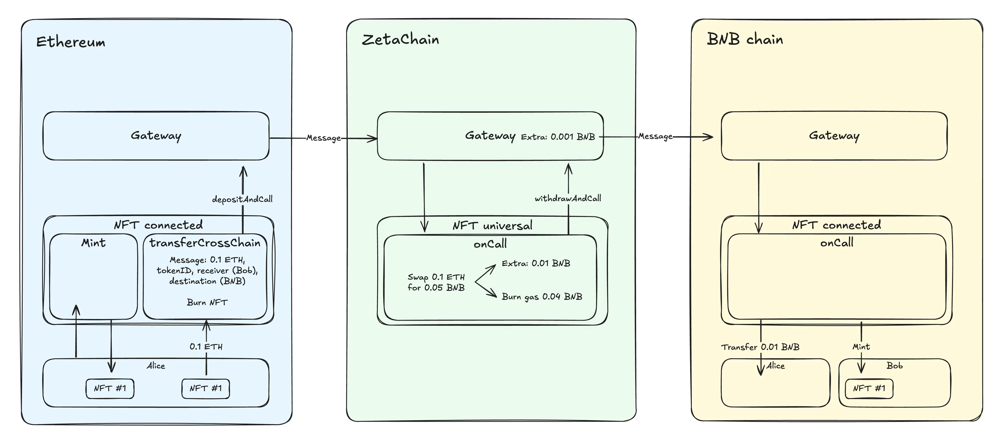

|标题|描述|
|:-|:-|
|概述|一套使 NFT 和 同质化代币 具备 跨链互操作性 的标准|

通用 NFT（Universal NFT）和通用代币（Universal Token）标准，使非同质化代币（ERC-721 NFT）和同质化代币（ERC-20）能够在任何链上铸造（mint），并在连接链（Connected Chains）之间无缝转移。

为简单起见，本文档中将通用 NFT 和通用代币统称为“资产”（assets）。

在链间转移资产时，资产会在源链（source chain）上被销毁（burn）。该资产的元数据和信息会通过一条消息（message）发送至目标链（destination chain）上的资产合约，并在那里铸造（mint）一个对应的资产。

通用 NFT 和通用代币项目都包含两个合约：**Universal**（通用）合约和 **Connected**（连接）合约。

`Universal` 合约部署在 ZetaChain 上，用于：

* 在 ZetaChain 上铸造资产
* 将资产从 ZetaChain 转移到连接链
* 处理从连接链到 ZetaChain 的入站资产转移
* 处理连接链之间的资产转移

`Connected` 合约部署在一个或多个连接的 EVM 链上，用于：

* 在连接链上铸造资产
* 将资产转移到另一个连接链或 ZetaChain
* 处理来自 ZetaChain 或另一个连接链的入站资产转移

在 ZetaChain 上部署 `Universal` 合约是必需的，而 `Connected` 合约则可根据需要部署，以启用特定链的资产转移。

通用资产可以在任何链上铸造 —— ZetaChain 或任何连接的 EVM 链。

对于通用 NFT，当资产被铸造时，会获得一个跨所有链唯一的持久 ID。当资产在链间转移时，该 ID 保持不变。

资产可以从 ZetaChain 转移到连接链，从连接链转移到 ZetaChain，以及在连接链之间转移。ZetaChain 充当跨链交易（cross-chain transactions）的中心枢纽，因此所有转移都通过它路由。例如，当将资产从 Ethereum 转移到 BNB 时，会发起两笔跨链交易：Ethereum → ZetaChain → BNB。这不会影响转移的时间或成本，但能让系统在添加更多链时线性扩展。

跨链资产转移支持回退（reverts）。如果转移在目标链上失败，资产将被退还给源链上的原始发送者。

资产合约仅接受来自受信任合约的跨链调用（cross-chain calls）。连接链上的每个合约都存储 ZetaChain 上的 `Universal` 合约地址。反过来，`Universal` 合约也存储其他链上 `Connected` 合约的地址。这确保只有同一资产集合的合约能参与跨链转移（cross-chain transfers）。

以下是使用通用 NFT 作为示例的流程：



## 部署

1. 在 ZetaChain 上部署 **Universal** 合约。这是必需步骤，因为 ZetaChain 充当所有跨链转移（cross-chain transfers）的中心枢纽，即使在连接的 EVM 链之间也是如此。

2. 在支持的 EVM 链（例如 Ethereum、Base、Polygon、BNB）上部署 **Connected** 合约。

3. 在 ZetaChain 上的 `Universal` 合约中运行：

   ```solidity
   setConnected(zrc20, connectedAddress)
   ```

   * `zrc20`：目标 EVM 链的 [ZRC-20 合约](https://www.zetachain.com/docs/developers/evm/zrc20)，用于标识链。
   * `connectedAddress`：EVM 链上 **Connected** 合约的地址（来自第 2 步）。

4. 在连接的 EVM 链上运行：

   ```solidity
   ConnectedAsset.setUniversal(universalAddress)
   ```

   其中 `universalAddress` 为 ZetaChain 上 **Universal** 合约的地址（来自第 1 步）。

此时，您已在 ZetaChain 与连接的 EVM 链上部署并链接了受信任的资产合约。

要启用向其他 EVM 链的转移，请为每个新链重复第 2 步和第 3 步。

> `setConnected` 和 `setUniversal` 是在资产合约之间建立安全信任关系所必需的。每个合约都会验证跨链调用（cross-chain calls）是否源自受信任的对应方。

## Gas 费用

* **EVM → ZetaChain：** 不收取跨链费用。
* **ZetaChain → EVM：** 以 **ZETA** 支付跨链费用，具体取决于目标链的 ZRC-20 提现费用。ZETA 会自动兑换（swap）为目标链的 Gas 代币 ZRC-20，以支付执行费用。
* **EVM → EVM：** 以 **源链的 Gas 代币** 支付跨链费用。例如，如果将资产从 Ethereum 转移到 BNB，费用将以 ETH 支付。ZetaChain 使用 ZRC-20 ETH 来支付执行费用，并将其兑换（swap）为 ZRC-20 BNB 来调用目标链。

## 回退（Revert）处理

如果跨链转移（cross-chain transfer）在目标链上失败（例如，由于 Gas 不足、合约拒绝或网络错误），资产将 **回退（reverted）给原始发送者**。

当两个连接的 EVM 链之间的转移失败时，资产将回退给 **ZetaChain 上的原始发送者**，而不是原始源链。这避免了返回到发起转移的 EVM 链所带来的高昂成本操作。之后，发送者可向同一或其他链重新发起转移。
