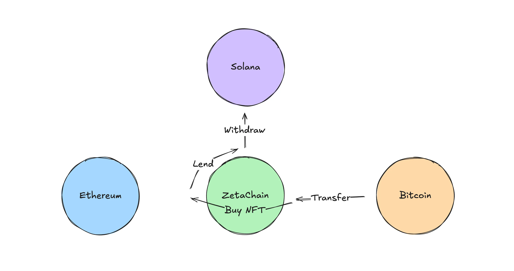
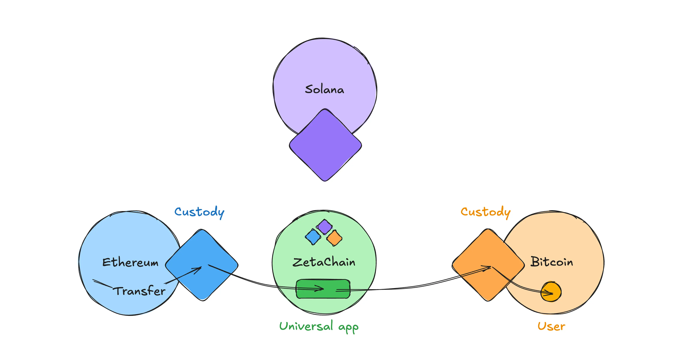

|标题|描述|
|:-|:-|
|为什么要在ZetaChain上构建？|跨链协调、跨链原生代币转移、免Gas费执行环境|

ZetaChain 是一个助力开发者打造通用应用的平台，这些应用能与任意区块链无缝交互。无论你的应用需要在以太坊（Ethereum）、币安智能链（BNB Chain）、索拉纳（Solana）、TON 等区块链，还是在比特币（Bitcoin）这类非智能合约区块链上运行，ZetaChain 都能提供基础设施，以极低的操作复杂度实现这一目标。ZetaChain 将不同的区块链生态系统整合到单一开发框架下，让你的应用能轻松在所有区块链上运行。

## 1. 跨链协调（Chain Orchestration）

ZetaChain 的突出功能之一，是能通过单个智能合约协调多个区块链间的复杂交易。基于 ZetaChain 构建的通用应用，可管理来自不同区块链的代币转入和合约调用，并向已连接的网络发起转出交易——所有操作均在统一框架内完成。

例如，假设有一个需要同时与以太坊和索拉纳交互的应用。传统方式下，这需要单独的代码库，还需处理两条链间复杂的通信协议。而借助 ZetaChain，你的通用应用能无缝处理这些操作，无需多个合约或复杂的互操作解决方案，即可实现跨链交易协调。

这种跨链协调能力简化了开发流程，降低了出错概率，并确保应用在整合更多区块链时能实现规模化扩展。

## 2. 向前兼容性（Forward Compatibility）
当你在 ZetaChain 上部署应用后，它会自动连接到 ZetaChain 生态系统中的所有网络。随着新区块链的加入，你的通用应用无需对合约源代码进行任何额外修改或操作，就能获得与这些新网络的兼容性。这种向前兼容性是一大优势，能让你的应用具备“未来适应性”。你无需预测未来哪些区块链会流行或被广泛采用，只要这些区块链接入 ZetaChain，你的应用就能立即与之交互。这不仅节省开发时间，还能确保你的应用在不同区块链网络中始终保持相关性和可访问性。

该功能还简化了应用维护工作：无需在新区块链接入时更新合约或重新部署应用。即便底层区块链环境不断变化，你的应用仍能稳定运行，为用户提供一致的体验。

## 3. 原生代币转移（Transfer Native Tokens）

基于 ZetaChain 的通用应用，核心能力之一是支持在所有已连接的链间使用原生代币转移价值。这意味着用户可直接使用各区块链的原生资产进行交易，而非其封装版（wrapped）或合成版（synthetic）代币。

例如，用户可将以太坊上的原生 USDC 直接转入Polygon，或将比特币网络上的原生 BTC 兑换为以太坊上的 PEPE 代币。这种跨链代币转移功能提升了流动性，提供了无缝体验，无需中介机构或复杂的代币封装机制。

为实现这些转移，通用应用可访问 ZetaChain 上的统一流动性池。这些资金池整合了所有已连接区块链的流动性，包含从各网络转入 ZetaChain 的代币。

向这些统一流动性池添加流动性，需将代币转入 ZetaChain 验证者在对应链上的托管账户。例如，ZetaChain 验证者会在以太坊上托管 ETH、USDC 及其他代币。这种托管机制通过稳健的共识协议和验证者激励机制保障安全，确保资产安全。

该系统允许用户在通用应用与各链之间直接转移代币，无需中心化交易所或第三方跨链桥。它简化了用户体验，降低了跨链交易相关风险，如双花（double-spending）或交易失败。

通过使用原生代币，用户能享受这些资产的固有属性，包括安全特性、共识机制和已有的网络效应。这提升了通过 ZetaChain 驱动的通用应用进行跨链操作时的可信度和可靠性。

## 4. 熟悉的开发者体验（Familiar Developer Experience）
ZetaChain 基于其通用以太坊虚拟机（Universal Ethereum Virtual Machine，UEVM）运行智能合约，该虚拟机与以太坊的 EVM 完全兼容。这意味着开发者可使用 Solidity 或其他 EVM 兼容语言编写智能合约，充分利用已有的知识和经验。

该平台开箱即支持 Foundry、Hardhat、Slither、Ethers.js 等主流开发工具。这种兼容性让开发者能沿用熟悉的工作流程、调试工具和测试框架，提高通用应用的开发效率，减少出错概率。

例如，若你习惯使用 Hardhat 在以太坊上编译和部署智能合约，那么在 ZetaChain 上也能无缝使用该工具。这降低了学习成本，加快了开发进程，让你能专注于打造创新功能，而非花费精力适应新工具或语言。

## 5. 免Gas费的以太坊虚拟机执行环境（Gasless EVM Execution Environment）
ZetaChain 的另一大亮点功能是其免Gas费的以太坊虚拟机执行环境。通用应用在 ZetaChain 的 EVM 上运行，可接收来自所有已连接链的用户和合约调用。当某条已连接链调用通用应用时，用户仅需在该调用链上支付 Gas 费，在 ZetaChain 上执行时无需额外支付费用。这让 ZetaChain 成为部署合约的高性价比、免Gas费环境，大幅降低终端用户的成本，提升应用的可访问性。

对终端用户而言，免Gas费执行环境意味着他们在与通用应用交互时，无需担心在多条链上产生高额交易费用。

传统的消息传递解决方案通常缺乏专用执行环境，这意味着每次合约调用都需在调用双方链上支付 Gas 费。这不仅增加成本，还会让交易处理变得更复杂。ZetaChain 的免Gas费环境消除了这些障碍，为跨链合约执行提供了更顺畅、高效的路径。

## 结语（Conclusion）
ZetaChain 为开发可与任意区块链交互的通用应用提供了全面解决方案。强大的跨链协调、向前兼容性、原生代币转移和免Gas费执行环境，大幅降低了跨链应用开发中常见的技术和财务门槛。通过提供熟悉的开发者体验，并确保应用在新区块链加入时能无缝扩展，ZetaChain 让应用具备“未来适应性”，使其更易访问、更高效，为广泛采用奠定基础。
